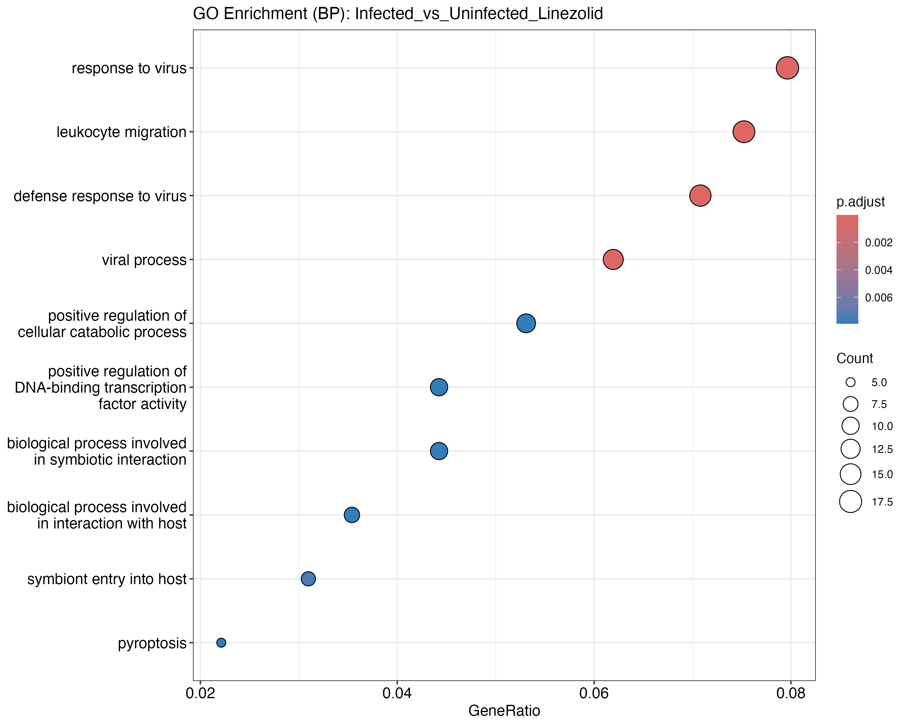

```{r class.source='fold-hide', setup, include=FALSE}
## Global options
library(knitr)
library(rmdformats)
library(tinytex)
options(max.print="75")
opts_chunk$set(echo=TRUE,
	             cache=FALSE,
               prompt=FALSE,
               tidy=TRUE,
               comment=NA,
               message=FALSE,
               warning=FALSE)
opts_knit$set(width=75)
knitr::opts_chunk$set(echo = TRUE, tidy = TRUE, tidy.opts = list(width.cutoff = 60))
```

# Introducción y Objetivos

En este trabajo se realizará un análisis de datos de mediante métodos y herramientas tanto estadísticas como bioinformáticas. Se parte de 35 muestras de sangre de ratón secuenciadas mediante microarrays a diferentes tiempos, tratamientos e infecciones. Estos datos se han descargado del repositorio Gene Expression Omnibus con el código `GSE38531`. En la siguiente tabla se puede apreciar los detalles del dataset:

```{r datos_estudio, include=FALSE}
# tabla de datos
data <- data.frame(
  sample = c(
    "GSM944831", "GSM944838", "GSM944845", "GSM944852", "GSM944859",
    "GSM944833", "GSM944840", "GSM944847", "GSM944854", "GSM944861",
    "GSM944834", "GSM944841", "GSM944848", "GSM944855", "GSM944862",
    "GSM944832", "GSM944839", "GSM944846", "GSM944853", "GSM944860",
    "GSM944835", "GSM944842", "GSM944849", "GSM944856", "GSM944863",
    "GSM944836", "GSM944843", "GSM944850", "GSM944857", "GSM944864",
    "GSM944837", "GSM944844", "GSM944851", "GSM944858", "GSM944865"
  ),
  infection = c(
    rep("uninfected", 15), rep("S. aureus USA300", 20)
  ),
  time = c(
    rep("hour 0", 15), rep(c("hour 2", "hour 24"), each = 5, times = 2)
  ),
  agent = c(
    rep("untreated", 5), rep("linezolid", 5), rep("vancomycin", 5),
    rep("untreated", 5), rep("untreated", 5),
    rep("linezolid", 5), rep("vancomycin", 5)
  )
)
```

```{r tabla_estudio, echo=FALSE}
# Imprimir la tabla en formato kable
kable(data)
```

De las 35 muestras, 15 fueron tomadas antes de la infección por *Staphylococcus aureus* resistente a meticilina (MRSA), y 20 después, 5 a las 2 horas de la misma (que serán eliminadas) y 15 a las 24 horas. Además, se investiga la utilidad de dos antibióticos para la inmunomodulación durante infecciones de MRSA, por lo tanto hay 15 ratones sin tratar, 10 ratones tratados con el antibiótico Linezolid y otros 10 tratados con Vancomicina.

El objetivo principal será caracterizar, a través de los cambios en la expresión génica, el efecto de la infección y el tratamiento con antibióticos, así como comparar las diferencias entre estos tratamientos. Para ello, se realizarán las siguientes comparaciones:

-   Infectados vs. no infectados sin tratamiento

-   Infectados vs. no infectados tratados con LINEZOLID

-   Infectados vs. no infectados tratados con VANCOMICINA

Estas comparaciones generarán tres listas de genes que deberán ser analizadas de dos maneras:

-   Caracterización mediante análisis de significación biológica

-   Comparación entre las listas obtenidas

# Métodos

**Origen y naturaleza de los datos**

Inicialmente, se descargaron los datos crudos del repositorio GEO, correspondientes al conjunto de datos `GSE38531`, el cual consta de 35 archivos .CEL obtenidos mediante la secuenciación de sangre de ratones utilizando sondas de Affymetrix.

**Herramientas informáticas**

Los paquetes de R utilizados en los siguientes

Paquetes de CRAN:

-   `R.utils`: Funciones de utilidad general.

-   `pheatmap`: Creación de mapas de calor.

-   `pvca`: Análisis de Componentes de Varianza Principal.

-   `ggplot2`: Paquete general para visualización de datos.

Paquetes de Bioconductor:

-   `clusterProfiler`: Para análisis de enriquecimiento funcional.

-   `org.Mm.eg.db`: Base de datos de anotaciones para Mus musculus (ratón).

-   `GO.db`: Términos y anotaciones de Gene Ontology.

-   `limma`: Modelos lineales y análisis de expresión diferencial.

-   `oligo`: Preprocesamiento y análisis de arrays de oligonucleótidos.

-   `Biobase`: Funciones base para estructuras de datos de Bioconductor.

-   `arrayQualityMetrics`: Evaluación de la calidad de datos de arrays.

-   `genefilter`: Funciones para filtrar genes en datos de alto rendimiento.

-   `mouse4302.db`: Paquete de anotación para el array Mouse430_2 de Affymetrix.

-   `AnnotationDbi`: Interfaz para bases de datos de anotaciones.

**Procedimiento general del análisis**

Se ha analizado la evaluación, normalización, filtrado y análisis de expresión génica diferencial, seguido de la visualización de los resultados y la interpretación biológica de los mismos.De manera resumida, se ha elaborado:

-   **Preparación de los datos**: Se preparan los directorios y se filtran utilizando la función `selectSamples` los datos para seleccionar un subconjunto representativo de muestras (sin la condición "hour 2"). Se renombraron y descomprimieron los archivos .CEL de microarrays.

-   **Lectura de los datos crudos**: Se cargan los archivos .CEL seleccionados y se generan objetos de tipo `ExpressionSet` que contienen los datos de expresión génica sin procesar.

-   **Análisis exploratorio y control de calidad**: Se realizan gráficos como boxplots, clustering jerárquico y Análisis de Componentes Principales (PCA) para evaluar la calidad y distribución de los datos.

-   **Normalización**: Los datos son normalizados utilizando el método RMA (Robust Multi-array Average) y se genera un nuevo conjunto de datos normalizados.

-   **Control de efectos de batch**: Se usa el paquete PVCA para evaluar los efectos de factores como la infección, el tratamiento y el tiempo sobre la variabilidad de los datos.

-   **Filtrado de los datos**: Se aplica un filtro sobre los genes en base a su variabilidad (usando el IQR) y se genera un conjunto de datos filtrados.

-   **Modelado estadístico y pruebas de hipótesis**: Se construye una matriz de diseño para un análisis de diferencias de expresión génica utilizando el modelo lineal (limma). Se estiman los contrastes entre las condiciones experimentales y se identifican los genes diferencialmente expresados (DEGs).

-   **Anotación de genes**: Los genes diferencialmente expresados se anotan utilizando paquetes de anotación como 'mouse4302.db'.

-   **Visualización**: Se generan gráficos como diagramas de Venn, volcano plots y heatmaps para visualizar los resultados de la expresión génica diferencial y las relaciones entre los genes.

-   **Análisis funcional**: Se realiza un análisis de la significación biológica mediante la identificación de genes anotados asociados con funciones biológicas relevantes y las condiciones experimentales.

# Resultados

## Preparación de los datos

```{r working_directory}
# creamos un working directory
workingDir <- getwd()
# ruta donde se encuentran los datos
dataDir <- file.path(workingDir, "datos")
# ruta donde se depositarán los resultados
resultsDir <- file.path(workingDir, "resultados")
```

```{r filter_microarray_function, include=FALSE}
# función selectSamples.R:
filter_microarray <- function(allTargets, seed = 123) {
  # Configurar la semilla aleatoria
  set.seed(21012126)
  
  # Filtrar las filas donde 'time' no sea 'hour 2'
  filtered <- subset(allTargets, time != "hour 2")
  
  # Dividir el dataset por grupos únicos de 'infection' + 'agent'
  filtered$group <- interaction(filtered$infection, filtered$agent)
  
  # Seleccionar 4 muestras al azar de cada grupo
  selected <- do.call(rbind, lapply(split(filtered, filtered$group), function(group_data) {
    if (nrow(group_data) > 4) {
      group_data[sample(1:nrow(group_data), 4), ]
    } else {
      group_data
    }
  }))
  
  # Obtener los índices originales como nombres de las filas seleccionadas
  original_indices <- match(selected$sample, allTargets$sample)
  
  # Modificar los rownames usando 'sample' y los índices originales
  rownames(selected) <- paste0(selected$sample, ".", original_indices)
  
  # Eliminar la columna 'group' y devolver el resultado
  selected$group <- NULL
  return(selected)
}
# Simular el dataset basado en la descripción proporcionada
allTargets <- data.frame(
  sample = c("GSM944831", "GSM944838", "GSM944845", "GSM944852", "GSM944859",
             "GSM944833", "GSM944840", "GSM944847", "GSM944854", "GSM944861",
             "GSM944834", "GSM944841", "GSM944848", "GSM944855", "GSM944862",
             "GSM944832", "GSM944839", "GSM944846", "GSM944853", "GSM944860",
             "GSM944835", "GSM944842", "GSM944849", "GSM944856", "GSM944863",
             "GSM944836", "GSM944843", "GSM944850", "GSM944857", "GSM944864",
             "GSM944837", "GSM944844", "GSM944851", "GSM944858", "GSM944865"),
  infection = c(rep("uninfected", 15), rep("S. aureus USA300", 20)),
  time = c(rep("hour 0", 15), rep("hour 2", 5), rep("hour 24", 15)),
  agent = c(rep("untreated", 5), rep("linezolid", 5), rep("vancomycin", 5),
            rep("untreated", 5), rep("untreated", 5), rep("linezolid", 5), rep("vancomycin", 5))
)
```

```{r filter_microarray}
# Aplicar la función
result <- filter_microarray(allTargets, seed=21012126)
```

```{r unzip_archivos, include=FALSE}
cambio <- FALSE
if (cambio) {
  # RENOMBRAMOS Y DESCOMPRIMIMOS LOS ARCHIVOS
  # Obtener la lista de archivos en el directorio actual que terminan en .CEL.gz
  archivos <- list.files(path = "datos/", pattern = "\\.CEL\\.gz$", full.names = TRUE)
  # Renombrar los archivos usando gsub para extraer la parte inicial GSMxxxxxx y añadir ".CEL.gz"
  archivos_nuevos <- gsub("^(GSM\\d+).*\\.CEL\\.gz$", "\\1.CEL.gz", basename(archivos))
  # Ver los nombres originales y nuevos
  data.frame(Original = basename(archivos), Nuevo = archivos_nuevos)
  # Renombrar los archivos en el sistema
  file.rename(from = archivos, to = file.path(dirname(archivos), archivos_nuevos))
  # Listar archivos .CEL.gz en tu directorio
  gz_files <- list.files(path = "datos/", pattern = "\\.CEL\\.gz$", full.names = TRUE)
  # Descomprimir todos los archivos
  sapply(gz_files, gunzip, remove = TRUE)
  # nombramos aquellos datos seleccionados
  selected_files <- paste0(result$sample, ".CEL")
  # Mover los archivos seleccionados a la nueva carpeta
  # Definir las rutas completas de origen y destino
  destination_dir <- file.path(workingDir, "datos/selected/")
  # Mover los archivos seleccionados de la carpeta "datos" a la carpeta "datos_selected"
  for (file in selected_files) {
    # Generar las rutas completas de los archivos
    source_path <- file.path(dataDir, file)
    destination_path <- file.path(destination_dir, file)
    # Verificar si el archivo existe en la carpeta de origen
    if (file.exists(source_path)) {
      # Mover el archivo a la carpeta destino
      file.rename(source_path, destination_path)
      message(paste("Movido:", file))
    } else {
      message(paste("El archivo", file, "no existe en la carpeta de origen"))
    }
  }
}
```

Tras la descarga de los datos crudos (llamado raw data) y seleccionando aquellas condiciones con la función `selectSamples`, se ha generado el `ExpressionFeatureSet`:

```{r generacion_ExpressionFeatureSet}
library(oligo)
library(Biobase)
# carpeta donde están los archivos seleccionados
destination_dir <- file.path(workingDir, "datos/selected/")
# lista de los archivos .CEL seleccionados
CELfiles <- list.files(path = "datos/selected/", full.names = F)
# generamos el ExpressionFeatureSet
sampleNames <- result$sample
targets <- AnnotatedDataFrame(result)
rawData <- read.celfiles(file.path(destination_dir, CELfiles), phenoData = targets)
rawData
```

## Análisis exploratorio y control de calidad

Primero se hace un análisis exploratorio y control de calidad con funciones *ad-hoc*. Podemos visualizar fácilmente la distribución de los valores de intensidad de los arrays utilizando boxplots.

```{r boxplot_raw}
boxplot(rawData,,which = "all", cex.axis = 0.6,las = 2,
        main = "Intensity distribution of RAW data", names = sampleNames)
```

Se observa una ligera variación de intensidad entre los arrays, pero esto es normal para los datos crudos. Es por ello que posteriormente se normalizan los datos para corregir estas diferencias.

Se reaaliza una agrupación jerárquica para ver si existen agrupaciones de muestras:

```{r clustering_jerarquico}
# HIERARQUICAL CLUSTERING
clust.euclid.average <- hclust(dist(t(exprs(rawData))), method = "average")
plot(clust.euclid.average, labels = sampleNames, main = "Hierarchical clustering of Raw Data",
     cex = 0.7, hang = -1)
```

Se aprecia que las muestras se agrupan de diferentes formas, no existiendo dos o tres grupos principales como podría ser en el caso de los ratones infectados y no infectados.

Se realiza un análisis de las componentes principales (PCA), que busca las fuentes de mayor variabilidad de los datos. Para ello escribimos una función *ad-hoc* que realice el PCA y lo represente con el paquete `ggplot`:

```{r PCA}
# PRINCIPAL COMPONENT ANALYSIS
library(ggplot2)
plotPCA_ggplot <- function(X, labels = NULL, colors = NULL, dataDesc = "", scale = FALSE,
                           formapunts = NULL, myCex = 0.8, ...) {
  # realizamos PCA
  pcX <- prcomp(t(X), scale. = scale)
  # extraemos las proporciones de varianza
  loads <- round(pcX$sdev^2 / sum(pcX$sdev^2) * 100, 1)
  pcData <- as.data.frame(pcX$x[, 1:2])  # toma solo los primeros 2 PCs
  pcData$labels <- labels
  pcData$colors <- colors
  # nombres de los ejes
  xlab <- paste("PC1", loads[1], "%")
  ylab <- paste("PC2", loads[2], "%")
  # Crear el gráfico con ggplot2
  p <- ggplot(pcData, aes(x = PC1, y = PC2, color = colors, shape = colors)) +
    geom_point(size = 3) +  # Puntos
    geom_text(aes(label = labels), vjust = -0.5, cex = myCex) +  # etiquetas
    labs(title = paste("Plot of first 2 PCs for expressions in", dataDesc),
         x = xlab, y = ylab) +
    scale_color_manual(values = c("red", "blue", "orange", "purple")) +  # colores
    theme_minimal() +  # Tema limpio
    theme(legend.position = "top",  # Posición de la leyenda
          legend.title = element_text(size = 10),
          legend.text = element_text(size = 8))
  print(p)  # muestra el gráfico
}

# usamos la función con los datos crudos
plotPCA_ggplot(exprs(rawData), labels = sampleNames, dataDesc = "Raw data", 
               colors = as.factor(result$agent), formapunts = c(rep(16, 4), rep(17, 4)), myCex = 0.8)
```

En este caso vemos que la primera componente explica el 31.3% de la variabilidad y la segunda el 20%, es decir las dos primeras componentes explican el 50% de la variabilidad. Además, se ha pintado los puntos por el tratamiento antibiótico utilizado.

`arrayQualityMetrics` nos permite generar gráficos de control de calidad sobre los datos crudos, aunque la información que nos aporta no es mucho mayor.

```{r arrayQualityMetrics}
library("arrayQualityMetrics")
# Avoid re-running it each time the script is executed.
rerun <- FALSE
if (rerun) {
  arrayQualityMetrics(rawData, reporttitle = "QC_RawData", force = TRUE)
}
```

Nos genera gráficas muy similares (boxplots y PCA), pero además podemos ver si hay presencia de outliers:

{width="388"}

Se aprecia que no hay ninguna muestra en la que se haya detectado outliers en los boxplots (2), pero sí en la distancia entre arrays (1) y en los MA plots (3). Todos los resultados generados por la función `arrayQualityMetrics` se han depositado en una carpeta denominada `QC_RawData`.

## Filtrado de los datos

Previo filtrado, primero se normalizan los datos:

```{r Normalizacion}
eset <- rma(rawData)
write.exprs(eset, file.path(resultsDir, "NormData.txt"))
eset
# mediante boxplot:
boxplot(eset,which = "all", cex.axis = 0.6,las = 2,
        main = "Intensity distribution of NORMALIZED data", names = sampleNames)
```

Vemos que la distribución ha mejorado, reduciendo diferencias. Veamos el PCA utilizando la función ya descrita `plotPCA_ggplot`:

```{r PCA plot}
plotPCA_ggplot(exprs(eset), labels = sampleNames, dataDesc = "Normalized data", 
               colors = as.factor(result$agent), formapunts = c(rep(16, 4), rep(17, 4)), myCex = 0.8)
```

Vemos que las dos primeras componentes ahora explican el 60% de la variabilidad. Antes de filtrar, veamos si existe efecto batch con la infección o con los antibióticos:

```{r PVCA}
library(pvca)

# factores categóricos
pData(eset)$infection <- as.factor(pData(eset)$infection)
pData(eset)$time <- as.factor(pData(eset)$time)
pData(eset)$agent <- as.factor(pData(eset)$agent)

# Configurar factores y parámetros
# pct_threshold: define el porcentaje mínimo de varianza que debe explicarse
pct_threshold <- 0.6
batch.factors <- c("infection", "time", "agent")

# Ejecutar PVCA
pvcaObj <- pvcaBatchAssess(eset, batch.factors, pct_threshold)
pvcaObj
# Graficar resultados
bp <- barplot(
  pvcaObj$dat, 
  xlab = "Effects", 
  ylab = "Weighted average proportion variance", 
  main = "PVCA estimation",
  ylim= c(0,1.1),col = c("darkred"), las=2
)
axis(1, at = bp, labels = pvcaObj$label, cex.axis = 0.75, las = 2)
text(bp, pvcaObj$dat, labels = round(pvcaObj$dat, 3), pos = 3, cex = 0.7)
```

El gráfico PVCA (*Principal Variance Component Analysis*) muestra la proporción promedio ponderada de varianza explicada por cada efecto o en los datos. Esto permite identificar qué factores contribuyen más a la variabilidad en la expresión génica. El tipo de antibiótico (*agent*) explica un 0.5% de la variabilidad total, la infección explica un 1.4% de la variabilidad y el tiempo un 2.3%. Se aprecia que el componente residual (96%) domina la variabilidad, lo que indica que la mayor parte de la varianza en los datos no se puede explicar por los factores infection, agent ni time ni por sus interacciones. Esto se puede deber a que exista variabilidad técnica en la plataforma experimental o debido a heterogeneidad biológica en las muestras.

Segudamente, se filtran aquellos genes cuya variabilidad puede atribuirse a variación aleatoria. Para ello se emplea la función `nsFilter` del paquete de Bioconductor `genefilter`, que puede utilizarse para eliminar genes en función de un umbral de variabilidad. Además, al disponer del paquete de anotación `mouse4302.db` que asocia identificadores de sondas con identificadores de genes, también puede emplearse para eliminar conjuntos de sondas que no tengan un identificador de gen asociado.

```{r Filtrado}
library(genefilter)
library(mouse4302.db)
annotation(eset) <- "mouse4302"
eset_filtered <- nsFilter(eset, var.func = IQR, var.cutoff = 0.75, var.filter = TRUE, filterByQuantile = TRUE, require.entrez = TRUE)
# extraemos la matriz de datos filtrados
filteredEset <- eset_filtered$eset
filteredData <- exprs(filteredEset)
colnames(filteredData) <- pData(eset_filtered$eset)$sample
filteredEset
print(eset_filtered$filter.log)
```

Después del filtrado, quedan 5120 genes.

## Construcción de las matrices de diseño y de contrastes

La selección de genes diferencialmente expresados consiste en realizar pruebas para comparar la expresión génica entre grupos. En los experimentos de microarrays, se utilizan métodos que reducen la varianza, como el que implementa el paquete `limma`. El primer paso en este tipo de análisis es crear la matriz de diseño, que es una tabla que asigna cada muestra a un grupo o condición experimental. Esta tabla tiene tantas filas como muestras y tantas columnas como grupos (si solo se considera un factor).

En nuestro caso queremos realizar las siguientes comparaciones:

-   Infectados vs. no infectados sin tratamiento
-   Infectados vs. no infectados tratados con LINEZOLID
-   Infectados vs. no infectados tratados con VANCOMICINA

Por lo que crearemos una matriz de diseño donde juntemos los siguientes casos:

-   Sin tratamiento (uninfected_untreated)

-   Tratados con linezolid (uninfected_linezolid)

-   Tratados con vancomicina (uninfected_vancomycin)

-   Infectados sin tratamiento (S..aureus.USA300_untreated)

-   Infectados tratados con linezolid (S..aureus.USA300_linezolid)

-   Infectados tratados con vancomicina (S..aureus.USA300_vancomycin)

```{r Matriz_diseno}
library(limma)
# Creamos un factor combinado: infection + agent
group <- paste(pData(filteredEset)$infection, pData(filteredEset)$agent, sep = "_")
group <- make.names(group)
group <- factor(group)
# Creamos la matriz de diseño
design <- model.matrix(~0 + group)
colnames(design) <- levels(group)
rownames(design) <- sampleNames(filteredEset)
# Mostramos la matriz de diseño
kable(design)
```

La matriz de contrastes se utiliza para describir las comparaciones entre grupos. Consta de tantas columnas como comparaciones y tantas filas como grupos. Una comparación entre grupos, denominada “contraste”, se representa con un “1” y un “-1” en las filas de los grupos a comparar, y ceros en el resto. Si varios grupos intervienen en la comparación, tendrá tantos coeficientes como grupos, con la única restricción de que su suma sea cero. Generamos la matriz de contrastes:

```{r Matriz_contrastes}
# Crear la matriz de contrastes
cont.matrix <- makeContrasts(
  Infected_vs_Uninfected_Untreated = S..aureus.USA300_untreated - uninfected_untreated,
  Infected_vs_Uninfected_Linezolid  = S..aureus.USA300_linezolid - uninfected_linezolid,
  Infected_vs_Uninfected_Vancomycin = S..aureus.USA300_vancomycin - uninfected_vancomycin,
  levels = design
)
# Mostrar la matriz de contrastes
kable(cont.matrix)
```

Una vez establecida la matriz de diseño y los contrastes, se procede a estimar el modelo, calcular los contrastes y realizar las pruebas de significancia para determinar, en cada gen y comparación, si estos pueden considerarse diferencialmente expresados. El paquete `limma` emplea modelos de Bayes Empíricos para combinar estimaciones de variabilidad globales e individuales, lo que mejora la precisión de las estimaciones de error.

El análisis genera estadísticas clave como el cambio en la expresión (Fold-change) y valores de p ajustados mediante el método de Benjamini y Hochberg, los cuales permiten ordenar los genes según su grado de expresión diferencial.

Toda la información resultante se almacena en un objeto de clase `MArrayLM` del paquete limma, identificado en este caso como `fit.main`.

```{r comparacion}
# estimamos el modelo
fit<-lmFit(filteredEset, design)
fit.main<-contrasts.fit(fit, cont.matrix)
fit.main<-eBayes(fit.main)
class(fit.main)

# comparación entre listas de genes
res<-decideTests(fit.main, method="separate", adjust.method="none", p.value=0.1, lfc=1)
sum.res.rows<-apply(abs(res),1,sum)
res.selected<-res[sum.res.rows!=0,] 
print(summary(res))
```

Podemos dibujar mediante un diagrama de Venn los genes diferencialmente expresados en las tres condiciones y sus comparaciones con un FDR\<0.1 y un logFC\>1:

```{r Diagrama_Venn, echo=FALSE}
# dibujamos un diagrama de venn:
vennDiagram(res.selected[,1:3], include=c("up", "down"),
            counts.col=c("red", "blue"),
            circle.col = c("red", "blue", "green3"), cex=c(1,1,1))
title("Genes in common between the three comparisons\n Genes selected with FDR < 0.1 and logFC > 1")
```

Los números en rojo representan genes con regulación al alza (up-regulated), mientras que los números en azul corresponden a genes con regulación a la baja (down-regulated) en las comparaciones realizadas entre las condiciones de no infectado versus infectado, y entre infectados sin tratamiento y tratados con los dos antibióticos. Cabe destacar que no se identificaron genes regulados de manera consistente (ni al alza ni a la baja) que fueran comunes a las tres comparaciones. Sin embargo, se observaron 6 genes con regulación al alza compartidos entre las condiciones de tratamiento con vancomicina y sin tratamiento, así como un único gen con regulación al alza compartido entre los tratamientos con vancomicina y linezolid.

## Obtención de las listas de genes diferencialmente expresados para cada comparación

El paquete limma implementa la función `topTable`, que proporciona, para un contraste dado, una lista de genes ordenada desde el menor hasta el mayor valor p, lo que permite identificar los genes más y menos diferencialmente expresados. Para cada gen, se ofrecen las siguientes estadísticas:

-   logFC: Diferencia media entre los grupos.
-   AveExpr: Expresión promedio de todos los genes en la comparación.
-   t: Estadístico t moderado (similar al estadístico de un test t para la comparación).
-   P.Value: Valor p del test.
-   adj.P.Val: Valor p ajustado según Benjamini y Hochberg.
-   B: Estadístico B (probabilidades de que el gen sea diferencialmente expresado frente a no serlo).

Utilizamos la función topTable para extraer los estadísticos de las tres comparaciones que estamos realizando:

```{r top_tabs}
# obtenemos las listas de los DEGs sin anotar
topTab1 <- topTable(fit.main, number = nrow(fit.main), coef ="Infected_vs_Uninfected_Untreated", adjust = "fdr")
topTab2 <- topTable(fit.main, number = nrow(fit.main), coef ="Infected_vs_Uninfected_Linezolid", adjust = "fdr")
topTab3 <- topTable(fit.main, number = nrow(fit.main), coef ="Infected_vs_Uninfected_Vancomycin", adjust = "fdr")
kable(head(topTab1))
```

Como se puede observar, los identificadores de genes corresponden a probesets de microarrays de Affymetrix, por lo que se requiere asignar cada identificador a un gen de ratón.

## Anotacion de los genes

Una vez que se tiene la tabla de resultados, es útil proporcionar información adicional sobre las características que han sido seleccionadas. Este proceso se llama "anotación" y su objetivo principal es asociar los identificadores que aparecen en la tabla de resultados (generalmente correspondientes a probesets o transcritos, dependiendo del tipo de microarreglo) con nombres más familiares, como el símbolo del gen, el identificador de Entrez Gene o la descripción del gen.

Para simplificar el proceso, dado que se tienen tres tablas de resultados, se ha preparado y utilizado una función que realiza la anotación de una tabla de resultados con un paquete determinado.

```{r Anotacion_genes}
# anotamos las listas mediante la función annotatedTopTable
annotatedTopTable <- function(topTab, anotPackage){
  topTab <- cbind(PROBEID=rownames(topTab), topTab)
  myProbes <- rownames(topTab)
  thePackage <- eval(parse(text = anotPackage))
  geneAnots <- select(thePackage, myProbes, c("SYMBOL", "ENTREZID", "GENENAME"))
  annotatedTopTab<- merge(x=geneAnots, y=topTab, by.x="PROBEID", by.y="PROBEID")
  return(annotatedTopTab)
  }

# generamos las listas anotadas
topAnnotated_Untreated <- annotatedTopTable(topTab1, anotPackage="mouse4302.db")
topAnnotated_Linezolid <- annotatedTopTable(topTab2, anotPackage="mouse4302.db")
topAnnotated_Vancomycin <- annotatedTopTable(topTab3, anotPackage="mouse4302.db")
kable(head(topAnnotated_Untreated))
```

Una visualización de la expresión diferencial se puede obtener utilizando volcano plots. Estos gráficos muestran si hay muchos o pocos genes con un cambio significativo en la expresión (fold-change, en el eje X) y significativamente expresados (en el eje Y), o si este número es bajo.

Dibujamos un volcano plot para cada una de las tres condiciones que estamos estudiando. Los nombres de los primeros diez genes en la tabla de resultados están indicados en el gráfico.

Sin tratar:

```{r VP_Untreated, echo=FALSE}
geneSymbols <- select(mouse4302.db, rownames(fit.main), c("SYMBOL"))
SYMBOLS<- geneSymbols$SYMBOL
# dibujamos el volcano plot
volcanoplot(fit.main, coef=1, highlight=10, names=SYMBOLS, 
            main=paste("Differentially expressed genes", colnames(cont.matrix)[1], sep="\n"))
abline(v=c(-1,1))
```

Tratados con Linezolid:

```{r VP_Linezolid, echo=FALSE}
volcanoplot(fit.main, coef=2, highlight=10, names=SYMBOLS, 
            main=paste("Differentially expressed genes", colnames(cont.matrix)[2], sep="\n"))
abline(v=c(-1,1))
```

Tratados con Vancomicina:

```{r VP_Vancomycin, echo=FALSE}
volcanoplot(fit.main, coef=3, highlight=10, names=SYMBOLS, 
            main=paste("Differentially expressed genes", colnames(cont.matrix)[3], sep="\n"))
abline(v=c(-1,1))
```

También podemos utilizar un heatmap. En este caso somos más restrictivos para que nos muestre un número menor de genes (p-value \< 0.05 y logFC \> 1.5):

```{r Heatmap_DEG, echo=FALSE}
library(pheatmap)
library(AnnotationDbi)

# Obtener los genes diferencialmente expresados de las comparaciones
selected_genes <- unique(c(
  rownames(topTab1[topTab1$P.Value < 0.05 & abs(topTab1$logFC) > 1.5, ]),
  rownames(topTab2[topTab2$P.Value < 0.05 & abs(topTab2$logFC) > 1.5, ]),
  rownames(topTab3[topTab3$P.Value < 0.05 & abs(topTab3$logFC) > 1.5, ])
))

# Obtener los símbolos de los genes para los probes seleccionados
symbols <- select(mouse4302.db, keys = selected_genes, columns = "SYMBOL", keytype = "PROBEID")
# Filtrar para eliminar cualquier valor NA o duplicado en la columna SYMBOL
symbols <- symbols[!is.na(symbols$SYMBOL), ]
symbols <- unique(symbols$SYMBOL)
# Filtrar la matriz de expresión con los genes seleccionados
heatmap_data <- exprs(filteredEset)[selected_genes, ]
# las filas de la matriz de expresión coincidan con los símbolos
rownames(heatmap_data) <- symbols
# Escalar las filas (genes) para una mejor visualización
scaled_data <- t(scale(t(heatmap_data)))
# Crear el heatmap con los nombres de los genes anotados
pheatmap(
  scaled_data,
  cluster_rows = TRUE,
  cluster_cols = TRUE,
  show_rownames = TRUE,
  show_colnames = TRUE,
  annotation_col = pData(filteredEset)[, c("infection", "agent")],
  main = "Heatmap of Differentially Expressed Genes",
  color = colorRampPalette(c("blue", "white", "red"))(50)
)
```

## Análisis de la significación biológica

Una vez obtenida una lista de genes que caracteriza la diferencia entre dos condiciones, debe interpretarse. Un enfoque estadístico conocido como "*Gene Set Analysis*" puede ser útil para sugerir ideas para la interpretación, ya que busca determinar si, dada una lista de genes seleccionados por ser diferencialmente expresados entre dos condiciones, las funciones, procesos biológicos o vías moleculares que los caracterizan aparecen en esta lista con más frecuencia que en el resto de los genes analizados. Para ello utilizaremos el paquete `clusterProfiler` de Bioconductor.

Este tipo de análisis necesita un número mínimo de genes para ser confiable, preferiblemente unos pocos cientos en lugar de unas pocas docenas. Por lo tanto, es común realizar una selección menos restrictiva que en los pasos anteriores. Por ejemplo, una opción es incluir todos los genes con un umbral FDR no estricto, como p-valor \< 0.1, sin filtrar por "fold-change" mínimo.

El primer paso es preparar la lista de genes que serán analizados:

```{r Anotacion}
library(AnnotationDbi)
listOfTables <- list(Infected_vs_Uninfected_Untreated = topTab1, 
                     Infected_vs_Uninfected_Linezolid  = topTab2, 
                     Infected_vs_Uninfected_Vancomycin = topTab3)
# iniciamos una lista vacía para guardar los resultados
listOfSelected <- list()
# seleccionamos los genes
for (i in 1:length(listOfTables)) {
  # seleccionamos la toptable
  topTab <- listOfTables[[i]]
  # seleccionamos los genes que superen el umbral estadístico
  whichGenes <- topTab[,"P.Value"] < 0.1
  selectedIDs <- rownames(topTab)[whichGenes]
  # convertimos los IDs de sondas en IDs de Entrez usando AnnotationDbi::select
  EntrezIDs <- AnnotationDbi::select(
    mouse4302.db,
    keys = selectedIDs,          # Input probe IDs
    columns = "ENTREZID",        # Column to retrieve
    keytype = "PROBEID"          # Type of input IDs
  )
  # extraemos solo los Entrez IDs (quitamos duplicados y NAs)
  EntrezIDs <- unique(na.omit(EntrezIDs$ENTREZID))
  # guardamos los Entrez IDs en una lista
  listOfSelected[[i]] <- EntrezIDs
  names(listOfSelected)[i] <- names(listOfTables)[i]
}
# mostramos el número de genes por condición
sapply(listOfSelected, length)
```

Generamos un pequeño script que realice el análisis de enriquecimiento en las bases de datos GO (Gene Ontology) y KEGG (Kyoto Encyclopedia of Genes and Genomes) de las tres condiciones utilizando las funciones `enrichGO` y `enrichKEGG`:

```{r analisis_GO_KEGG, echo=FALSE}
library(clusterProfiler)
library(org.Mm.eg.db)

# Crear un directorio para guardar los resultados
if (!dir.exists("resultados")) dir.create("resultados")

# Bucle para realizar análisis de enriquecimiento en GO y KEGG
go <- FALSE
if (go) {
  for (i in 1:length(listOfSelected)) {
    comparisonName <- names(listOfSelected)[i]
    genes <- listOfSelected[[i]]
    
    # Análisis GO
    ego <- enrichGO(
      gene          = genes,
      OrgDb         = org.Mm.eg.db,
      keyType       = "ENTREZID",
      ont           = "BP",
      pAdjustMethod = "BH",
      qvalueCutoff  = 0.05,
      readable      = TRUE
    )
    
    # Análisis KEGG
    ekegg <- enrichKEGG(
      gene          = genes,
      organism      = "mmu",
      keyType       = "ncbi-geneid",
      pAdjustMethod = "BH",
      qvalueCutoff  = 0.05
    )
    
    # verificamos si hay resultados antes de generar los gráficos
    if (nrow(ego) > 0) {
      go_plot <- dotplot(ego, showCategory = 10, title = paste("GO Enrichment (BP):", comparisonName))
      ggsave(filename = paste0("resultados/GO_", comparisonName, ".png"), plot = go_plot, width = 10, height = 8, dpi = 300)
      write.table(as.data.frame(ego), file = paste0("resultados/GO_", comparisonName, ".txt"), sep = "\t", quote = FALSE, row.names = FALSE)
    } else {
      cat("No GO enrichment results for", comparisonName, "\n")
    }
    
    if (nrow(ekegg) > 0) {
      kegg_plot <- dotplot(ekegg, showCategory = 10, title = paste("KEGG Enrichment:", comparisonName))
      ggsave(filename = paste0("resultados/KEGG_", comparisonName, ".png"), plot = kegg_plot, width = 10, height = 8, dpi = 300)
      write.table(as.data.frame(ekegg), file = paste0("resultados/KEGG_", comparisonName, ".txt"), sep = "\t", quote = FALSE, row.names = FALSE)
    } else {
      cat("No KEGG enrichment results for", comparisonName, "\n")
    }
    
    # Imprimir gráficas
    cat("\n### Resultados para", comparisonName, "###\n")
    if (nrow(ego) > 0) print(head(ego))
    if (nrow(ekegg) > 0) print(head(ekegg))
  }
}
```

Los resultados obtenidos en el análisis de significancia biológica son:

-   Un archivo .txt con un resumen de todas las rutas enriquecidas de las bases de datos GO y KEGG y las estadísticas asociadas.
-   Un archivo .png con un gráfico de puntos de las rutas enriquecidas de las bases de datos GO y KEGG pintados por el p-valor ajustado y con el tamaño de puntos correspondiente al número de genes identificados en ese grupo.

En las siguientes figuras se muestran las gráficas de puntos del análisis de Gene Ontology para las tres categorías:





# Discusión

El análisis realizado en este estudio tiene como objetivo evaluar los efectos de la infección por *Staphylococcus aureus USA300* y los tratamientos con los antibióticos linezolid y vancomicina sobre la expresión génica en un modelo murino. A través de un análisis bioinformático, se han identificado los genes diferencialmente expresados en varias condiciones experimentales y se ha llevado a cabo un análisis detallado de la calidad de los datos, normalización, filtrado y anotación funcional.

**Calidad de los Datos y Preprocesamiento**

El análisis de calidad de los datos iniciales indicó una distribución adecuada de las intensidades de expresión en los datos crudos, con un boxplot que mostró una baja variabilidad en la intensidad entre las muestras. Sin embargo, tanto el análisis de agrupamiento jerárquico como el análisis de componentes principales (PCA) no revelaron un agrupamiento claro entre las muestras tratadas con o sin antibiótico, ni entre los diferentes días o condiciones de infección. Este fenómeno podría ser atribuido a la presencia de efectos de batch.

**Consideraciones sobre el Efecto de Batch**

El PCA también mostró una ligera variabilidad debida a efectos de batch, lo que podría estar relacionado con las condiciones experimentales y las diferencias técnicas entre los lotes de muestras. Sin embargo, la evaluación de la variabilidad utilizando el análisis de la proporción de varianza de la técnica PVCA indicó que los factores biológicos, como la infección y el tratamiento, explican una mayor proporción de la variabilidad en los datos que los factores técnicos. Esto sugiere que los resultados observados en el análisis de DEGs son confiables y reflejan cambios biológicos relevantes.

**Efectos de los Tratamientos Antibióticos**

El tratamiento con linezolid y vancomicina tuvo un efecto claro sobre la expresión génica, con varios genes regulados diferencialmente entre las condiciones tratadas y no tratadas. Esto se puede ver en el diagrama de Venn, que en el número de genes down regulados es mayor en presencia de tratamiento. En cuanto a los genes up regulados, es diferente ya que la condición sin tratar cuenta con mayor número de genes up regulados. Esto podría sugerir que linezolid y vancomicina tengan mecanismos de acción distintos en el tratamiento de la infección por *S. aureus*.

**Análisis Funcional y Enriquecimiento de Vías**

El análisis funcional y el enriquecimiento de vías para los genes diferencialmente expresados identificaron varias rutas biológicas relevantes, incluida la respuesta a infecciones virales y la respuesta inmune. Además, en el caso de los ratones tratados con antibiótico, muestran un aumento en las rutas de señalización de muerte celular, pudiendo ser un mecanismo de respuesta antiviral.

**Limitaciones del Estudio**

A pesar de los avances en el análisis, este estudio presenta algunas limitaciones. Primero, el número de muestras y el diseño experimental podrían ser insuficientes para detectar efectos sutiles en la expresión génica, especialmente en las comparaciones entre los tratamientos antibióticos. Además, aunque hemos filtrado y controlado la calidad de los datos, los efectos de batch podrían haber influido en los resultados, aunque la mayor parte de la variabilidad parece ser biológica en lugar de técnica. Finalmente, aunque la anotación de los genes ha proporcionado información valiosa, el análisis funcional podría beneficiarse de una mayor integración con otros datos ómicos, como la proteómica y la metabolómica, para obtener una visión más completa de la respuesta a la infección y al tratamiento.

**Conclusión**

En resumen, este estudio proporciona una visión integral de la respuesta génica a la infección por *S. aureus* y el tratamiento con antibióticos. Los resultados sugieren que ambos factores juegan un papel crucial en la modulación de la expresión génica, particularmente en las rutas de respuesta inmune. Sin embargo, se necesita más investigación para profundizar en los mecanismos moleculares subyacentes y para validar estos hallazgos en otros modelos y condiciones clínicas. La integración de datos adicionales, como la información proteómica, permitiría una comprensión más completa de los efectos biológicos y terapéuticos en este contexto.

# Referencias

Todo el código y el output generado se encuentra en el repositorio de GitHub: <https://github.com/sergiroigso/Roig-Soucase-Sergi-PEC2.git>

Los datos crudos se han descargado de GEO: <https://www.ncbi.nlm.nih.gov/geo/query/acc.cgi?acc=GSE38531>

Otros materiales consultados:

-   <https://aspteaching.github.io/Omics_Data_Analysis-Case_Study_1-Microarrays/Case_Study_1-Microarrays_Analysis.html>

-   <https://github.com/ASPteaching/Omics_Data_Analysis-Case_Study_1-Microarrays>

-   <https://aspteaching.github.io/Analisis_de_datos_omicos-Materiales_para_un_curso/exploraci%C3%B3n-de-los-datos-control-de-calidad-y-preprocesado.html#introducci%C3%B3n>

# Apéndices

El código completo es el siguiente:

```{r, eval=FALSE}
######### Paquetes

# Instalar BiocManager si no está disponible
if (!requireNamespace("BiocManager", quietly = TRUE))
  install.packages("BiocManager")

# Lista de paquetes de Bioconductor
bioconductor_packages <- c(
  "clusterProfiler", "org.Mm.eg.db", "GO.db", "limma", "oligo",
  "Biobase", "arrayQualityMetrics", "genefilter", "mouse4302.db",
  "AnnotationDbi"
)

# Instalar paquetes de Bioconductor
for (pkg in bioconductor_packages) {
  if (!requireNamespace(pkg, quietly = TRUE)) {
    BiocManager::install(pkg)
  }
}

# Lista de paquetes de CRAN
cran_packages <- c("R.utils", "pheatmap", "pvca", "ggplot2")

# Instalar paquetes de CRAN
for (pkg in cran_packages) {
  if (!requireNamespace(pkg, quietly = TRUE)) {
    install.packages(pkg)
  }
}

library(clusterProfiler)
library(org.Mm.eg.db)
library(clusterProfiler)
library(GO.db)
library(limma)
library(R.utils)
library(oligo)
library(Biobase)
library(arrayQualityMetrics)
library(genefilter)
library(mouse4302.db)
library(AnnotationDbi)
library(pheatmap)
library(pvca)
library(ggplot2)

######### Preparación de los datos

# creamos un working directory
workingDir <- getwd()
# ruta donde se encuentran los datos
dataDir <- file.path(workingDir, "datos")
# ruta donde se depositarán los resultados
resultsDir <- file.path(workingDir, "resultados")

# función selectSamples.R:
filter_microarray <- function(allTargets, seed = 123) {
  # Configurar la semilla aleatoria
  set.seed(21012126)
  
  # Filtrar las filas donde 'time' no sea 'hour 2'
  filtered <- subset(allTargets, time != "hour 2")
  
  # Dividir el dataset por grupos únicos de 'infection' + 'agent'
  filtered$group <- interaction(filtered$infection, filtered$agent)
  
  # Seleccionar 4 muestras al azar de cada grupo
  selected <- do.call(rbind, lapply(split(filtered, filtered$group), function(group_data) {
    if (nrow(group_data) > 4) {
      group_data[sample(1:nrow(group_data), 4), ]
    } else {
      group_data
    }
  }))
  
  # Obtener los índices originales como nombres de las filas seleccionadas
  original_indices <- match(selected$sample, allTargets$sample)
  
  # Modificar los rownames usando 'sample' y los índices originales
  rownames(selected) <- paste0(selected$sample, ".", original_indices)
  
  # Eliminar la columna 'group' y devolver el resultado
  selected$group <- NULL
  return(selected)
}
# Simular el dataset basado en la descripción proporcionada
allTargets <- data.frame(
  sample = c("GSM944831", "GSM944838", "GSM944845", "GSM944852", "GSM944859",
             "GSM944833", "GSM944840", "GSM944847", "GSM944854", "GSM944861",
             "GSM944834", "GSM944841", "GSM944848", "GSM944855", "GSM944862",
             "GSM944832", "GSM944839", "GSM944846", "GSM944853", "GSM944860",
             "GSM944835", "GSM944842", "GSM944849", "GSM944856", "GSM944863",
             "GSM944836", "GSM944843", "GSM944850", "GSM944857", "GSM944864",
             "GSM944837", "GSM944844", "GSM944851", "GSM944858", "GSM944865"),
  infection = c(rep("uninfected", 15), rep("S. aureus USA300", 20)),
  time = c(rep("hour 0", 15), rep("hour 2", 5), rep("hour 24", 15)),
  agent = c(rep("untreated", 5), rep("linezolid", 5), rep("vancomycin", 5),
            rep("untreated", 5), rep("untreated", 5), rep("linezolid", 5), rep("vancomycin", 5))
)
# Aplicar la función (cambiar 123 por vuestro ID de la UOC u otro número que podáis escribir en el documento)
result <- filter_microarray(allTargets, seed=21012126)

cambio <- FALSE
library(R.utils)
if (cambio) {
  # RENOMBRAMOS Y DESCOMPRIMIMOS LOS ARCHIVOS
  # Obtener la lista de archivos en el directorio actual que terminan en .CEL.gz
  archivos <- list.files(path = "datos/", pattern = "\\.CEL\\.gz$", full.names = TRUE)
  # Renombrar los archivos usando gsub para extraer la parte inicial GSMxxxxxx y añadir ".CEL.gz"
  archivos_nuevos <- gsub("^(GSM\\d+).*\\.CEL\\.gz$", "\\1.CEL.gz", basename(archivos))
  # Ver los nombres originales y nuevos
  data.frame(Original = basename(archivos), Nuevo = archivos_nuevos)
  # Renombrar los archivos en el sistema
  file.rename(from = archivos, to = file.path(dirname(archivos), archivos_nuevos))
  # Listar archivos .CEL.gz en tu directorio
  gz_files <- list.files(path = "datos/", pattern = "\\.CEL\\.gz$", full.names = TRUE)
  # Descomprimir todos los archivos
  sapply(gz_files, gunzip, remove = TRUE)
  # nombramos aquellos datos seleccionados
  selected_files <- paste0(result$sample, ".CEL")
  # Mover los archivos seleccionados a la nueva carpeta
  # Definir las rutas completas de origen y destino
  destination_dir <- file.path(workingDir, "datos/selected/")
  # Mover los archivos seleccionados de la carpeta "datos" a la carpeta "datos_selected"
  for (file in selected_files) {
    # Generar las rutas completas de los archivos
    source_path <- file.path(dataDir, file)
    destination_path <- file.path(destination_dir, file)
    # Verificar si el archivo existe en la carpeta de origen
    if (file.exists(source_path)) {
      # Mover el archivo a la carpeta destino
      file.rename(source_path, destination_path)
      message(paste("Movido:", file))
    } else {
      message(paste("El archivo", file, "no existe en la carpeta de origen"))
    }
  }
}


library(oligo)
library(Biobase)
# carpeta donde están los archivos seleccionados
destination_dir <- file.path(workingDir, "datos/selected/")
# lista de los archivos .CEL seleccionados
CELfiles <- list.files(path = "datos/selected/", full.names = F)
# nombre de los sample
sampleNames <- result$sample
targets <- AnnotatedDataFrame(result)
rawData <- read.celfiles(file.path(destination_dir, CELfiles), phenoData = targets)
# guardamos el archivo en un .rda
save(rawData, file = "GSE38531_raw.Rda")
rawData

######### Análisis exploratorio y control de calidad

# Boxplot
boxplot(rawData,,which = "all", cex.axis = 0.6,las = 2,
        main = "Intensity distribution of RAW data", names = sampleNames)

# HIERARQUICAL CLUSTERING
clust.euclid.average <- hclust(dist(t(exprs(rawData))), method = "average")
plot(clust.euclid.average, labels = sampleNames, main = "Hierarchical clustering of RawData",
     cex = 0.7, hang = -1)

# PRINCIPAL COMPONENT ANALYSIS

library(ggplot2)

plotPCA_ggplot <- function(X, labels = NULL, colors = NULL, dataDesc = "", scale = FALSE,
                           formapunts = NULL, myCex = 0.8, ...) {
  # realizamos PCA
  pcX <- prcomp(t(X), scale. = scale)
  
  # extraemos las proporciones de varianza
  loads <- round(pcX$sdev^2 / sum(pcX$sdev^2) * 100, 1)
  pcData <- as.data.frame(pcX$x[, 1:2])  # toma solo los primeros 2 PCs
  pcData$labels <- labels
  pcData$colors <- colors
  
  # nombres de los ejes
  xlab <- paste("PC1", loads[1], "%")
  ylab <- paste("PC2", loads[2], "%")
  
  # Crear el gráfico con ggplot2
  p <- ggplot(pcData, aes(x = PC1, y = PC2, color = colors, shape = colors)) +
    geom_point(size = 3) +  # Puntos
    geom_text(aes(label = labels), vjust = -0.5, cex = myCex) +  # etiquetas
    labs(title = paste("Plot of first 2 PCs for expressions in", dataDesc),
         x = xlab, y = ylab) +
    scale_color_manual(values = c("red", "blue", "orange", "purple")) +  # colores
    theme_minimal() +  # Tema limpio
    theme(legend.position = "top",  # Posición de la leyenda
          legend.title = element_text(size = 10),
          legend.text = element_text(size = 8))
  
  print(p)  # muestra el gráfico
}

# usamos la función con los datos crudos
plotPCA_ggplot(exprs(rawData), labels = sampleNames, dataDesc = "Raw data", 
               colors = as.factor(result$agent), formapunts = c(rep(16, 4), rep(17, 4)), myCex = 0.8)


# SAVE TO A FILE
pdf(file.path(resultsDir, "QCPlots_Raw.pdf"))
boxplot(rawData,,which = "all", cex.axis = 0.6,las = 2,
        main = "Intensity distribution of RAW data", names = sampleNames)
plot(clust.euclid.average, labels = sampleNames, main = "Hierarchical clustering of samples of RawData",
     cex = 0.7, hang = -1)
plotPCA_ggplot(exprs(rawData), labels = sampleNames, dataDesc = "Raw data", 
               colors = as.factor(result$agent), formapunts = c(rep(16, 4), rep(17, 4)), myCex = 0.8)
dev.off()

######### Paquete arrayqualitymetrics

library("arrayQualityMetrics")
# Avoid re-running it each time the script is executed.
rerun <- FALSE
if (rerun) {
  arrayQualityMetrics(rawData, reporttitle = "QC_RawData", force = TRUE)
}

######### Normalización

eset <- rma(rawData)
write.exprs(eset, file.path(resultsDir, "NormData.txt"))
boxplot(eset)
eset
# mediante boxplot:
boxplot(eset,,which = "all", cex.axis = 0.6,las = 2,
        main = "Intensity distribution of NORMALIZED data", names = sampleNames)

# Ahora, crear la gráfica con ggplot2
plotPCA_ggplot(exprs(eset), labels = sampleNames, dataDesc = "Normalized data", 
               colors = as.factor(result$agent), formapunts = c(rep(16, 4), rep(17, 4)), myCex = 0.8)


# Estudio efecto Batch

library(pvca)

# Asegúrate de que los factores son categóricos
pData(eset)$infection <- as.factor(pData(eset)$infection)
pData(eset)$time <- as.factor(pData(eset)$time)
pData(eset)$agent <- as.factor(pData(eset)$agent)

# Configurar factores y parámetros
pct_threshold <- 0.6
batch.factors <- c("infection", "time", "agent")

# Ejecutar PVCA
pvcaObj <- pvcaBatchAssess(eset, batch.factors, pct_threshold)

# Graficar resultados
bp <- barplot(
  pvcaObj$dat, 
  xlab = "Effects", 
  ylab = "Weighted average proportion variance", 
  main = "PVCA estimation",
  ylim= c(0,1),col = c("mediumorchid"), las=2
)
axis(1, at = bp, labels = pvcaObj$label, cex.axis = 0.75, las = 2)
text(bp, pvcaObj$dat, labels = round(pvcaObj$dat, 3), pos = 3, cex = 0.7)


######### Filtrado

library(genefilter)
library(mouse4302.db)
annotation(eset) <- "mouse4302"
eset_filtered <- nsFilter(eset, var.func = IQR, var.cutoff = 0.75, var.filter = TRUE, filterByQuantile = TRUE, require.entrez = TRUE)
# NUMBER OF GENES IN
print(eset_filtered$eset)
# extraemos la matriz de datos filtrados
filteredEset <- eset_filtered$eset
filteredData <- exprs(filteredEset)
colnames(filteredData) <- pData(eset_filtered$eset)$sample
print(eset_filtered$filter.log)

# guardamos los resultados normalizados y filtrados
write.csv(exprs(eset), file="./resultados/normalized.Data.csv")
write.csv(exprs(filteredEset), file="./resultados/normalized.Filtered.Data.csv")
save(eset, filteredEset, file="./resultados/normalized.Data.Rda")

######### Construcción de las matrices de diseño y de contrastes
library(limma)

# Creamos un factor combinado: infection + agent
group <- paste(pData(filteredEset)$infection, pData(filteredEset)$agent, sep = "_")
group <- make.names(group)
group <- factor(group)
# Creamos la matriz de diseño
design <- model.matrix(~0 + group)
colnames(design) <- levels(group)
rownames(design) <- sampleNames(filteredEset)
# Mostramos la matriz de diseño
print(design)

# Crear la matriz de contrastes
cont.matrix <- makeContrasts(
  Infected_vs_Uninfected_Untreated = S..aureus.USA300_untreated - uninfected_untreated,
  Infected_vs_Uninfected_Linezolid  = S..aureus.USA300_linezolid - uninfected_linezolid,
  Infected_vs_Uninfected_Vancomycin = S..aureus.USA300_vancomycin - uninfected_vancomycin,
  levels = design
)
# Mostrar la matriz de contrastes
print(cont.matrix)

# estimamos el modelo

fit<-lmFit(filteredEset, design)
fit.main<-contrasts.fit(fit, cont.matrix)
fit.main<-eBayes(fit.main)
class(fit.main)

# comparación entre listas de genes
# adjust.method = "fdr" ajusta los valores p usando el método FDR. 
# Si los valores ajustados son grandes, no se detectarán genes significativos.
res<-decideTests(fit.main, method="separate", adjust.method="none", p.value=0.1, lfc=1)
sum.res.rows<-apply(abs(res),1,sum)
res.selected<-res[sum.res.rows!=0,] 
print(summary(res))

# podemos hacer un diagrama de venn:
vennDiagram(res.selected[,1:3], include=c("up", "down"),
            counts.col=c("red", "blue"),
            circle.col = c("red", "blue", "green3"), cex=c(1,1,1))
title("Genes in common between the three comparisons\n Genes selected with FDR < 0.1 and logFC > 1")

######### Obtención de las listas de genes diferencialmente expresados para cada comparación

# obtenemos las listas de los DEGs sin anotar
topTab1 <- topTable(fit.main, number = nrow(fit.main), coef ="Infected_vs_Uninfected_Untreated", adjust = "fdr")
topTab2 <- topTable(fit.main, number = nrow(fit.main), coef ="Infected_vs_Uninfected_Linezolid", adjust = "fdr")
topTab3 <- topTable(fit.main, number = nrow(fit.main), coef ="Infected_vs_Uninfected_Vancomycin", adjust = "fdr")

######### Anotacion de los genes

# anotamos las listas mediante la función annotatedTopTable
annotatedTopTable <- function(topTab, anotPackage){
  topTab <- cbind(PROBEID=rownames(topTab), topTab)
  myProbes <- rownames(topTab)
  thePackage <- eval(parse(text = anotPackage))
  geneAnots <- select(thePackage, myProbes, c("SYMBOL", "ENTREZID", "GENENAME"))
  annotatedTopTab<- merge(x=geneAnots, y=topTab, by.x="PROBEID", by.y="PROBEID")
  return(annotatedTopTab)
  }

# generamos las listas anotadas
topAnnotated_Untreated <- annotatedTopTable(topTab1, anotPackage="mouse4302.db")
topAnnotated_Linezolid <- annotatedTopTable(topTab2, anotPackage="mouse4302.db")
topAnnotated_Vancomycin <- annotatedTopTable(topTab3, anotPackage="mouse4302.db")

# escribimos los resultados
library(xtable)
write.csv2(topAnnotated_Untreated, file = file.path(resultsDir, "Genes_UNTREATED.csv"))
print(xtable(topTab1, align = "lllllll"), type = "html", html.table.attributes = "",
      file = file.path(resultsDir, "Genes_UNTREATED.html"))
write.csv2(topAnnotated_Linezolid, file = file.path(resultsDir, "Genes_LINEZOLID.csv"))
print(xtable(topTab2, align = "lllllll"), type = "html", html.table.attributes = "",
      file = file.path(resultsDir, "Genes_LINEZOLID.html"))
write.csv2(topAnnotated_Vancomycin, file = file.path(resultsDir, "Genes_VANCOMYCIN.csv"))
print(xtable(topTab3, align = "lllllll"), type = "html", html.table.attributes = "",
      file = file.path(resultsDir, "Genes_VANCOMYCIN.html"))

# volcano plots
library(mouse4302.db)
geneSymbols <- select(mouse4302.db, rownames(fit.main), c("SYMBOL"))
SYMBOLS<- geneSymbols$SYMBOL

volcanoplot(fit.main, coef=1, highlight=10, names=SYMBOLS, 
            main=paste("Differentially expressed genes", colnames(cont.matrix)[1], sep="\n"))
abline(v=c(-1,1))

volcanoplot(fit.main, coef=2, highlight=10, names=SYMBOLS, 
            main=paste("Differentially expressed genes", colnames(cont.matrix)[2], sep="\n"))
abline(v=c(-1,1))

volcanoplot(fit.main, coef=3, highlight=10, names=SYMBOLS, 
            main=paste("Differentially expressed genes", colnames(cont.matrix)[3], sep="\n"))
abline(v=c(-1,1))

# heatmap

library(pheatmap)
library(mouse4302.db)
library(AnnotationDbi)

# Obtener los genes diferencialmente expresados de las comparaciones
selected_genes <- unique(c(
  rownames(topTab1[topTab1$P.Value < 0.05 & abs(topTab1$logFC) > 1.5, ]),
  rownames(topTab2[topTab2$P.Value < 0.05 & abs(topTab2$logFC) > 1.5, ]),
  rownames(topTab3[topTab3$P.Value < 0.05 & abs(topTab3$logFC) > 1.5, ])
))


# Obtener los símbolos de los genes para los probes seleccionados
symbols <- select(mouse4302.db, keys = selected_genes, columns = "SYMBOL", keytype = "PROBEID")

# Filtrar para eliminar cualquier valor NA o duplicado en la columna SYMBOL
symbols <- symbols[!is.na(symbols$SYMBOL), ]
symbols <- unique(symbols$SYMBOL)
# Filtrar la matriz de expresión con los genes seleccionados
heatmap_data <- exprs(filteredEset)[selected_genes, ]
# las filas de la matriz de expresión coincidan con los símbolos
rownames(heatmap_data) <- symbols
# Escalar las filas (genes) para una mejor visualización
scaled_data <- t(scale(t(heatmap_data)))
# Crear el heatmap con los nombres de los genes anotados
pheatmap(
  scaled_data,
  cluster_rows = TRUE,
  cluster_cols = TRUE,
  show_rownames = TRUE,
  show_colnames = TRUE,
  annotation_col = pData(filteredEset)[, c("infection", "agent")],
  main = "Heatmap of Differentially Expressed Genes",
  color = colorRampPalette(c("blue", "white", "red"))(50)
)


######### Análisis de la significación biológica

library(AnnotationDbi)

listOfTables <- list(Infected_vs_Uninfected_Untreated = topTab1, 
                     Infected_vs_Uninfected_Linezolid  = topTab2, 
                     Infected_vs_Uninfected_Vancomycin = topTab3)
# iniciamos una lista vacía para guardar los resultados
listOfSelected <- list()
# seleccionamos los genes
for (i in 1:length(listOfTables)) {
  # seleccionamos la toptable
  topTab <- listOfTables[[i]]
  # seleccionamos los genes que superen el umbral estadístico
  whichGenes <- topTab[,"P.Value"] < 0.1
  selectedIDs <- rownames(topTab)[whichGenes]
  # convertimos los IDs de sondas en IDs de Entrez usando AnnotationDbi::select
  EntrezIDs <- AnnotationDbi::select(
    mouse4302.db,
    keys = selectedIDs,          # Input probe IDs
    columns = "ENTREZID",        # Column to retrieve
    keytype = "PROBEID"          # Type of input IDs
  )
  # extraemos solo los Entrez IDs (quitamos duplicados y NAs)
  EntrezIDs <- unique(na.omit(EntrezIDs$ENTREZID))
  # guardamos los Entrez IDs en una lista
  listOfSelected[[i]] <- EntrezIDs
  names(listOfSelected)[i] <- names(listOfTables)[i]
}
# mostramos el número de genes por condición
sapply(listOfSelected, length)


# Cargar bibliotecas necesarias
library(clusterProfiler)
library(org.Mm.eg.db)
library(ReactomePA)
library(ggplot2)

# Crear un directorio para guardar los resultados
if (!dir.exists("resultados")) dir.create("resultados")

# Bucle para realizar análisis de enriquecimiento en GO, KEGG y Reactome
for (i in 1:length(listOfSelected)) {
  comparisonName <- names(listOfSelected)[i]
  genes <- listOfSelected[[i]]
  
  # Análisis GO
  ego <- enrichGO(
    gene          = genes,
    OrgDb         = org.Mm.eg.db,
    keyType       = "ENTREZID",
    ont           = "BP",
    pAdjustMethod = "BH",
    qvalueCutoff  = 0.05,
    readable      = TRUE
  )
  
  # Análisis KEGG
  ekegg <- enrichKEGG(
    gene          = genes,
    organism      = "mmu",
    keyType       = "ncbi-geneid",
    pAdjustMethod = "BH",
    qvalueCutoff  = 0.05
  )
  
  # Verifica si hay resultados antes de generar los gráficos
  if (nrow(ego) > 0) {
    go_plot <- dotplot(ego, showCategory = 10, title = paste("GO Enrichment (BP):", comparisonName))
    ggsave(filename = paste0("resultados/GO_", comparisonName, ".png"), plot = go_plot, width = 10, height = 8, dpi = 300)
    write.table(as.data.frame(ego), file = paste0("resultados/GO_", comparisonName, ".txt"), sep = "\t", quote = FALSE, row.names = FALSE)
  } else {
    cat("No GO enrichment results for", comparisonName, "\n")
  }
  
  if (nrow(ekegg) > 0) {
    kegg_plot <- dotplot(ekegg, showCategory = 10, title = paste("KEGG Enrichment:", comparisonName))
    ggsave(filename = paste0("resultados/KEGG_", comparisonName, ".png"), plot = kegg_plot, width = 10, height = 8, dpi = 300)
    write.table(as.data.frame(ekegg), file = paste0("resultados/KEGG_", comparisonName, ".txt"), sep = "\t", quote = FALSE, row.names = FALSE)
  } else {
    cat("No KEGG enrichment results for", comparisonName, "\n")
  }
  
  # Imprimir resumen
  cat("\n### Resultados para", comparisonName, "###\n")
  if (nrow(ego) > 0) print(head(ego))
  if (nrow(ekegg) > 0) print(head(ekegg))
}
```
